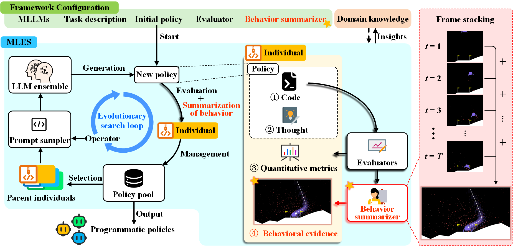
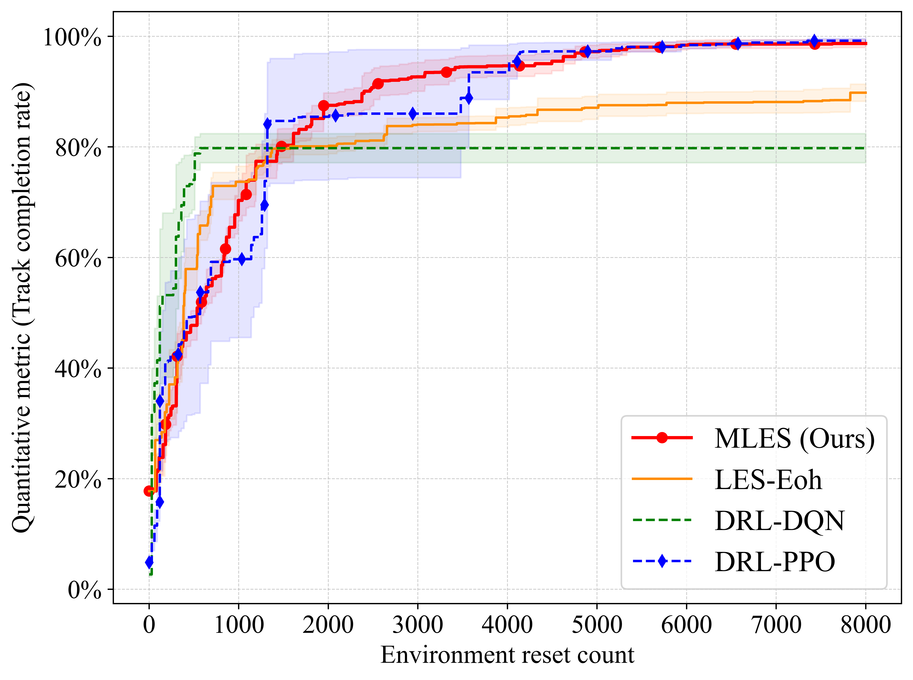

<div align="center">
<h1 align="center">MLES: Multimodal LLM-Assisted Evolutionary Search for Programmatic Control Policies</h1>

[](https://iclr.cc/)
[]()
[]()

<h3 align="center">Automated discovery of high-performing, interpretable, and verifiable control policies</h3>

[//]: # ([Paper]&#40;https://github.com/Optima-CityU/LLM4AD/tree/main/example&#41;)

</div>
<br>

---
## 📢 News
* **[2026-02]** 🔥 MLES has been integrated into the **[LLM4AD](https://github.com/Optima-CityU/llm4ad)** platform! LLM4AD is a comprehensive library for LLM-assisted algorithm design. You can now easily benchmark MLES against various other LLM-assisted Evolutionary Search methods. We welcome you to try it out!
* **[2025-12]** 🎉 Our paper *"Multimodal LLM-Assisted Evolutionary Search for Programmatic Control Policies"* has been accepted by **ICLR 2026**!
---

## Introduction 📖

Transparency and high performance are essential goals in designing control policies, particularly for safety-critical tasks. While Deep Reinforcement Learning (DRL) algorithms have dominated this space, their **"black-box"** nature makes them difficult to trust, debug, and safely deploy.

To address this challenge, we introduce **MLES** (Multimodal LLM-assisted Evolutionary Search). MLES offers a paradigm shift from opaque neural networks to **programmatic white-box policies**. It combines the advanced vision-language reasoning and code generation capabilities of Multimodal Large Language Models (MLLMs) with the iterative optimization strengths of evolutionary computation.

**How it works:** MLES is designed to mimic how human experts develop policies. Unlike traditional DRL methods that rely blindly on scalar rewards, or standard LLM-assisted Evolutionary Search (LES) methods that lack visual context, MLES **integrates visual feedback-driven behavior analysis** into the policy generation process. By scrutinizing execution traces to generate **Behavioral Evidence (BE)**, MLES identifies *why* a policy failed or succeeded (e.g., diagnosing "reward hacking" or late braking) and intelligently refines the programmatic policies with targeted, code-level improvements.

<p align="center">

</p>

### 🆚 DRL vs. LES vs. MLES

| Feature | 🤖 Traditional DRL (e.g., PPO/DQN) | 📝 Standard LES (e.g., EoH)             | 🚀 MLES (Ours) |
| :--- | :--- | :--- | :--- |
| **Policy Representation** | Opaque Neural Networks | **Human-readable Python Code** | **Human-readable Python Code** |
| **Optimization Guide** | Scalar Rewards | Scalar Metrics                          | **Visual Feedback + Scalar Metrics** |
| **Policy Discovery Process**| Black-box, hard to trace | Trial-and-error, lacks diagnostic depth | **Diagnostic, step-by-step traceable** |
| **Performance** | High | Moderate                                | **High (Comparable to PPO)** |

### ✨ Key Advantages

1. **Completely Transparent Control Policies**: Policies are directly synthesized as human-readable Python programs, making their logic entirely transparent, modular, and easily understandable.
2. **Traceable & Diagnostic Policy Design**: Every step of the policy evolution is meticulously recorded. The evolutionary process is driven by behavioral evidence, transforming stochastic trial-and-error into a grounded, diagnostic refinement process.
3. **Competitive Performance**: MLES achieves performance comparable to **Proximal Policy Optimization (PPO)** across standard control tasks (e.g., Lunar Lander and Car Racing), while offering significantly better sample efficiency in policy search.
4. **Knowledge Transfer & Reuse**: Because policies are represented as code, insights and logic can be easily transferred to new instances or modified by human experts in a collaborative loop.

In this repository, we showcase the application of MLES for automated policy discovery using the **Lunar Lander** and **Car Racing** environments as illustrative examples. We provide the discovered policies from our experiments and offer tools to analyze the evolutionary process.

---

## ⚙️ Requirements & Installation

You can quickly set up the required Python environment using the provided `environment.yaml` file.

1.  **Create the Conda environment**:
    ```bash
    conda env create -f environment.yaml
    ```

2.  **Activate the environment**:
    ```bash
    conda activate llm4ad_mles
    ```

---

## 💻 Example Usage

### Quick Start:

> [!NOTE]
> Before running the script, you'll need to configure your Large Language Model (LLM) API settings. Here's an example configuration for DeepSeek:
>
> 1.  Set `host`: `'api.deepseek.com'`
> 2.  Set `key`: `'your_api_key'` (Replace with your actual API key)
> 3.  Set `model`: `'deepseek-chat'`

```python
from llm4ad.task.machine_learning.car_racing import RacingCarEvaluation
from llm4ad.tools.llm.llm_api_https import HttpsApi
from llm4ad.method.mles import MLES
from llm4ad.method.mles import MLESProfiler

llm = HttpsApi(host='api.bltcy.ai',  # your host endpoint, e.g., api.openai.com/v1/completions, api.deepseek.com
               key='sk-xxxx',  # your key, e.g., sk-abcdefghijklmn
               model='gpt-4o-mini',  # your llm, e.g., gpt-3.5-turbo, deepseek-chat
               timeout=120)
log_dir = f'logs/MLES'  # Use run_id to avoid overwriting logs

seeds = [1]
instance_set = {}
for id, seed in enumerate(seeds):
    instance_set[id] = seed

# Using
using_algo_designed_path = ""
# Using_seeds = [i for i in range(20, 60)]
Using_seeds = [i for i in range(10, 20)]
# Using_seeds = seeds
ins_to_be_solve_set = {}
for id, seed in enumerate(Using_seeds):
    ins_to_be_solve_set[id] = seed

run_mode = 'Training'  # Training, Using, Combined
task = RacingCarEvaluation(whocall='mles',
                           run_mode=run_mode,
                           instance_set=instance_set,
                           ins_to_be_solve_set=ins_to_be_solve_set,
                           objective_value=100)

# 定义JSON文件路径
seedpath = r'pop_init.json'

method = MLES(llm=llm,
              profiler=MLESProfiler(log_dir=log_dir, log_style='complex', run_mode=run_mode,
                                    using_algo_designed_path=using_algo_designed_path),
              evaluation=task,
              max_sample_nums=100,
              max_generations=None,
              pop_size=16,
              num_samplers=8,
              num_evaluators=8,
              debug_mode=False,
              operators=('e1', 'e2', 'm1_M', 'm2_M'),  # ('e1', 'e2', 'm1_M', 'm2_M')
              seed_path=seedpath
              )

method.run()
```

In just about **an hour** of automated discovery, MLES can provide you with a near-perfect control policy for Car Racing!

<p align="center">

</p>

The discovery process is completely traceable and verifiable, offering insights into how policies evolve:

<p align="center">

</p>

Compared to traditional DRL algorithms like PPO and DQN, MLES demonstrates remarkably efficient algorithm discovery:

<p align="center">

</p>

---

## 📊 Analyzing Your MLES Results
We provide tools in the analysis_results directory to help you deeply understand the evolutionary process and comprehensively evaluate the performance of discovered policies.

🧬 Track Policy Ancestry (`analysis_family_of_one_individual_v2.py`):
Use this script to trace the entire lineage of any specific policy you're interested in. This allows you to explore its "family tree" and understand exactly how behavioral visual feedback drove its evolutionary path.

📈 Compare Performance & Efficiency (`LES_RL_behavior_v3.py` / `LES_method_behavior.py`):
Compare the performance and convergence efficiency of different methods on policy discovery tasks, giving you clear insights into MLES's advantages over traditional DRL baselines.

## ✨ Citation
If you find our work helpful, please consider citing our paper:

```bibtex
@inproceedings{
hu2026multimodal,
title={Multimodal {LLM}-assisted Evolutionary Search for Programmatic Control Policies},
author={Qinglong Hu and Tong Xialiang and Mingxuan Yuan and Fei Liu and Zhichao Lu and Qingfu Zhang},
booktitle={The Fourteenth International Conference on Learning Representations},
year={2026},
url={https://openreview.net/forum?id=OHFNJoNtjW}
}
```

